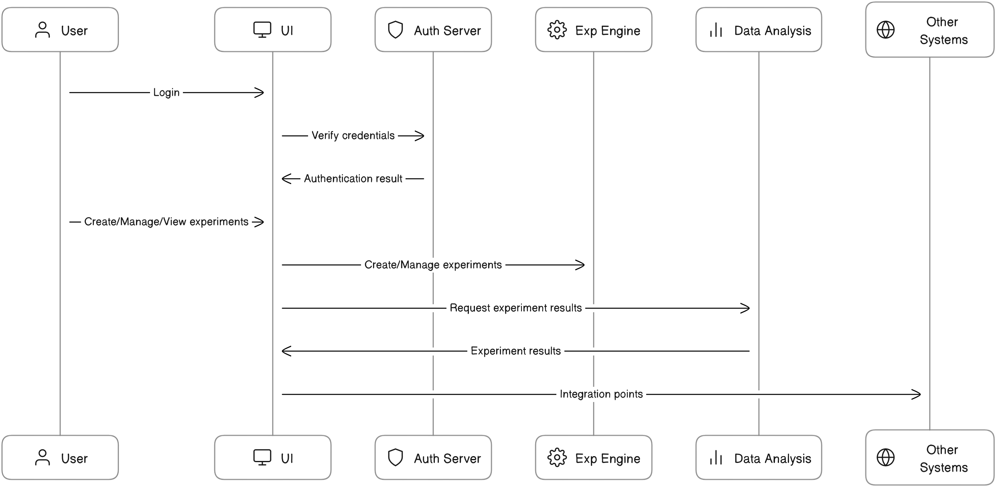
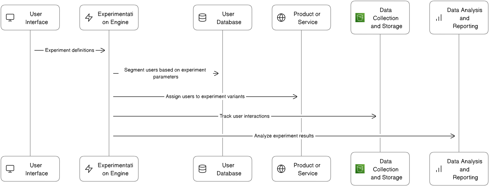

# Experimentation Platform

An experimentation platform will be a system that allows for the design, implementation, execution, and analysis of experiments to assess the impact of changes to a product, service, or system. 

It will typically include features for:

- **Defining and managing experiments**
- **Segmenting users** into test and control groups
- **Collecting and processing data**
- **Performing statistical analyses**
- **Reporting results**

This platform will be designed to support decision-making based on empirical data and statistical evidence, helping teams to  

- **Optimize their products**
- **Optimize their services**
- **Enhance the user experience**
- **Revise the Marketing Strategies**
- **Much more**

It will integrate with follwing systems in the tech stack

- **Analytics platforms**
- **Data storage solutions**
- **Customer data platforms**

Ultimately, experimentation platform will foster a culture of
- **Data-driven decision making**
- **Continuous learning**
- **Iterative improvement**
- **Enabling teams to test hypotheses**
- **Learn about user behavior**
- **Incrementally improve their offerings based on real-world evidence**

## Experimentation Platform Scope

1. **User Interface**: 
   - The experimentation platform should have a user-friendly interface, making it easy to navigate while offering comprehensive functionality.

2. **Roles and Permissions**: 
   - The experimentation platform should implement a robust roles and permissions system, ensuring that only authorized personnel can access sensitive data or features.

3. **Data Visualization**: 
   - The experimentation platform should be able to clearly visualize experimental data for easy analysis, possibly through graphs, charts, or other visual representations.

4. **Experiment Creation and Management**: 
   - The experimentation platform should allow users to easily create, run, stop, and manage experiments.

5. **Auditing and Logging**: 
   - The experimentation platform should log every action taken within the system for audit purposes, helping trace any issues or anomalies that occur during an experiment.

6. **Integration**: 
   - Depending on the specific needs, the experimentation platform might need to integrate with other tools or systems, such as data collection tools, analytics platforms, or other software relevant to the experiments.

7. **Scalability**: 
   - The experimentation platform should be designed to scale with user needs, being capable of handling an increasing amount of work or being enlarged to accommodate growth.

8. **Security**: 
   - The experimentation platform should be secure, with measures in place to protect against data breaches or unauthorized access.

9. **Documentation**: 
   - The experimentation platform should come with clear and comprehensive documentation for its users.
  
10. **Support**:
   - The experimentation platform should provide mechanisms for users to receive help when they encounter problems or have questions.

# User Interface Architecture Diagram

The diagram illustrates the following steps:

1. User logs into the Experimentation Platform UI.
2. The UI communicates with the Authentication Server to verify the user's credentials.
3. Once authenticated, the user can create, manage, and view experiments through the UI.
4. The UI communicates with the Experimentation Engine to create and manage experiments.
5. The UI communicates with the Data Analysis and Reporting component to display experiment results.
6. The UI may also have integration points with other systems, such as a user database or a product management tool.

You can edit and save this diagram online using the Eraser tool. 

# Experimentation Engine Integration Diagram

The diagram illustrates the following steps:

1. The Experimentation Engine receives experiment definitions from the User Interface.
2. The Engine communicates with the User Database to segment users based on the experiment parameters.
3. The Engine assigns users to different variants of the experiment.
4. The Engine communicates with the Product or Service being tested to apply the experiment variants.
5. The Engine communicates with the Data Collection and Storage component to track user interactions.
6. The Engine communicates with the Data Analysis and Reporting component to analyze the results of the experiment.

You can edit and save this diagram online using the Eraser tool.

